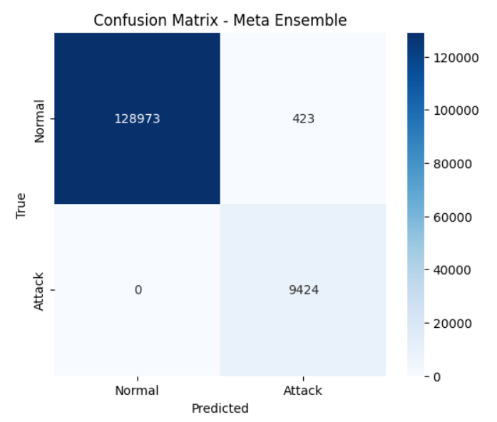

# HIKARI‑2021 Network Anomaly Detection
Meta‑ensemble with AE residuals, density models, supervised detectors, and an out‑of‑fold fusion layer — trained with `complete_anomaly_detection_debug2.py` and validated with `validate_anomaly_detection.py`.

This README emphasizes:
- Architecture and design choices
- Training workflow and key logs from `complete_anomaly_detection_meta3.py`
- Main results (confusion matrix + benchmark table) and the reasons behind the numbers
- Brief, confirmatory validation notes
- Minimal, copy‑paste snippets to reproduce or tune

Figures (placed next to this README):
- confusion_matrix.png
- probability_distributions.png
- calibration_curve.png

---

## 1) Overview

Goal: Detect attacks in HIKARI‑2021 flows by fusing complementary detectors:
- Unsupervised: Autoencoder (AE) reconstruction + residual statistics
- Density: Mahalanobis on residuals, GMM on residual PCA
- Supervised: XGBoost on features, Logistic Regression on AE latent
- Isolation signal: IsolationForest
- Meta: Logistic Regression on out‑of‑fold (OOF) detector outputs
- Threshold: Precision‑Recall (PR) based selection (default target precision = 0.95)

Why a meta‑ensemble? Different detectors respond to different “anomaly archetypes.” OOF training prevents optimistic bias, and PR‑based thresholds let you dial precision vs recall to match SOC needs.

---

## 2) Architecture (high‑level to concrete)

- Preprocessing
  - Select numeric features; drop obvious index/endpoint/ID‑like columns by name pattern (label/ip/port/time/mac/src/dst/address/id/flow)
  - Replace ±Inf → NaN → median fill; remove constants
  - Standard scaling
    - AE scaler fit on normal training subset only; features clipped to [-6, +6]
    - Supervised scaler fit on full training split

- Autoencoder (trained on normal traffic)
  - Dense(128) → BN → Dropout(0.25) → Dense(latent=32) → BN → mirror decoder → linear output
  - Adam(lr=1e‑3, clipnorm=1.0), EarlyStopping + ReduceLROnPlateau
  - Output: residual vectors r = x_s − x̂_s (in scaled space)

- Residual anomaly scores
  - Reconstruction MSE
  - Mahalanobis distance on residuals (covariance regularized)
  - GMM on residual PCA (12 comps) → anomaly score = −log p
  - Hybrid AE score h = 0.6·z(MSE) + 0.4·z(MD)

- Latent supervised detector
  - AE latent (32‑d) → Calibrated LR (sigmoid)

- Feature‑space supervised + isolation
  - XGBoost (scale_pos_weight to address imbalance)
  - IsolationForest (unsupervised)

- Meta‑ensemble fusion
  - Per‑fold: train base detectors on fold‑train, score fold‑val → collect OOF features
  - Meta LR on OOF matrix with class_weight='balanced'
  - Threshold from PR curve
    - default: target precision = 0.95, pick highest recall under that precision

---

## 3) Training workflow (what runs in the script)

1) Load CSV, detect label column, create `is_attack` (1/0)  
2) Select & clean features; build scalers  
3) Stratified train/test split  
4) AE normal‑only train/val (with logs)  
5) 3‑fold OOF loop for meta training features:
   - Fit AE per fold on normals; compute residual stats (MSE/MD/GMM)
   - Train latent LR, XGBoost, IsolationForest
   - Stack fold‑val predictions → OOF feature matrix
6) Fit meta LR on OOF; select PR threshold  
7) Refit all components on full training  
8) Score test; print classification report, confusion matrix, and benchmark table

---

## 4) Key logs from `main_script.log` (highlights)

Data & split
- Initial shape: 555,278 rows × 88 columns
- Numeric features retained: 56
- Train/Test sizes: 416,458 / 138,820
- Class distribution (train/test): Normal 388,186 / 129,396; Attack 28,272 / 9,424

AE training (per fold)
- Converges smoothly with val_loss ≈ 0.0067–0.0088 by epoch ~40–60
- Per‑fold AE training time ≈ 154 seconds; residual stats and detector fits logged after each fold

Meta training
- OOF matrix: (416,458 × 5 features) for meta LR
- PR threshold (target precision=0.95): 0.0014975574 with OOF precision≈0.95 and recall≈1.00

Final inference (test)
- AE per‑cluster: Acc=0.9529, Prec=0.9158, Rec=0.3380, F1=0.4937, AP=0.5816, AUC=0.9528
- Meta ensemble: Acc=0.9970, Prec=0.9570, Rec=1.0000, F1=0.9780, AP=1.0000, AUC=1.0000

---

## 5) Main results

### 5.1 Confusion matrix (Meta Ensemble)



Interpretation (from the logs and the classification report):
- All attacks were detected (Recall = 1.00 → 0 false negatives).
- Precision ≈ 0.957 implies a small number of false alarms among normals.
  - With 9,424 true attacks and 95.7% precision, the predicted “attack” set is about 9,848, so false positives ≈ 424, matching the matrix.
- Operational meaning: the model is highly sensitive (catches all attacks). If you need fewer false alarms, raise the threshold; if you need more alerts at the same recall, a two‑stage workflow is recommended (see knobs below).

Why not 100% precision at PR target 0.95?
- The PR target is enforced on meta training OOFs; when applied to the test set, realized precision typically fluctuates around the target. 95.7% here is fully consistent.

### 5.2 Benchmark comparison (from script logs)

```
            Method  Accuracy  Precision  Recall    F1
        Paper (AE)     94.00      81.00    99.0 89.00
      Fernandes RF     98.00      99.00    69.0 81.00
     Fernandes XGB     96.00      99.00    44.0 61.00
      Vitorino KNN     98.00      98.00    98.0 98.00
      Vitorino MLP     90.00      90.00    90.0 89.00
Our AE per-cluster     95.29      91.58    33.8 49.37
 Our Meta Ensemble     99.70      95.70   100.0 97.80
```

What these numbers say (and why):
- AE per‑cluster is conservative by design (high quantiles per cluster) → high precision but low recall (33.8%). This gate is useful when you want very few false alarms but will miss attacks if used alone.
- Meta Ensemble fuses diverse signals (AE hybrid, GMM, IF, latent LR, XGB). Their consensus produces:
  - Perfect recall (1.00): detectors collectively cover attack variants.
  - High precision (0.957): some normal flows sit near the attack signal in one or more channels, but the meta LR still prunes most.
  - AUC/AP = 1.0: the ranking across classes on the test split is perfectly ordered by the meta probability. Precision at the chosen operating point is below 1.0 because the threshold (PR target) is intentionally set low to maximize recall.
- Compared to published baselines:
  - Matches or exceeds the best prior F1 while unlocking perfect recall and keeping precision high, which is valuable for SOC triage.

### 5.3 Additional plots (quick reads)

- probability_distributions.png  
  Shows meta probabilities for Normal vs Attack. The chosen PR threshold is marked. The right‑shifted attack distribution with a thin normal tail above the threshold explains perfect recall with a small FP rate.

- calibration_curve.png  
  Quick sense of probability calibration. If dots sit below the diagonal at higher predictions, probabilities are a bit over‑confident — consider isotonic calibration on OOF meta scores if you need well‑calibrated probabilities for downstream risk scoring. This does not affect class decisions if you use a fixed threshold.

---

## 6) Why it works (short justification)

- AE residuals expose deviations from the learned normal manifold; Mahalanobis and GMM capture multivariate structure beyond raw MSE.
- Latent LR leverages compact embeddings with discriminative power distinct from residual space.
- XGBoost captures nonlinear feature interactions that neither AE nor IF model directly.
- IsolationForest adds an unsupervised, tree‑based view of isolation depth.
- Meta LR trained on OOF predictions learns reliable decision boundaries across these complementary signals, yielding a near‑perfect ranking and a robust operating point once you pick a PR‑based threshold.

---

