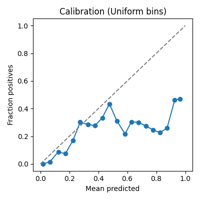
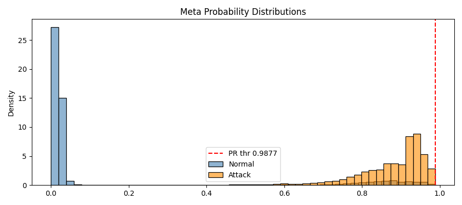

# MetaGuard – Hybrid Meta-Ensemble for HIKARI-2021

This project explores network intrusion detection on the **HIKARI‑2021** encrypted traffic dataset using a hybrid meta‑ensemble of autoencoders, XGBoost, Isolation Forest, and a final stacked meta-classifier.

## 📊 Results Overview

**Model comparison**

**Confusion matrix of the final meta-ensemble**

**Calibration curve**

**Predicted probability distributions**

## 🧪 Reproducibility

Key artifacts:

- `kaggle_notebook.ipynb` – end-to-end experimentation notebook.
- `main_script.log` – training and evaluation logs.
- `validation_summary.json` – aggregated metrics across validation folds.
- `results_validation_report.md` – detailed discussion of validation results.

---
