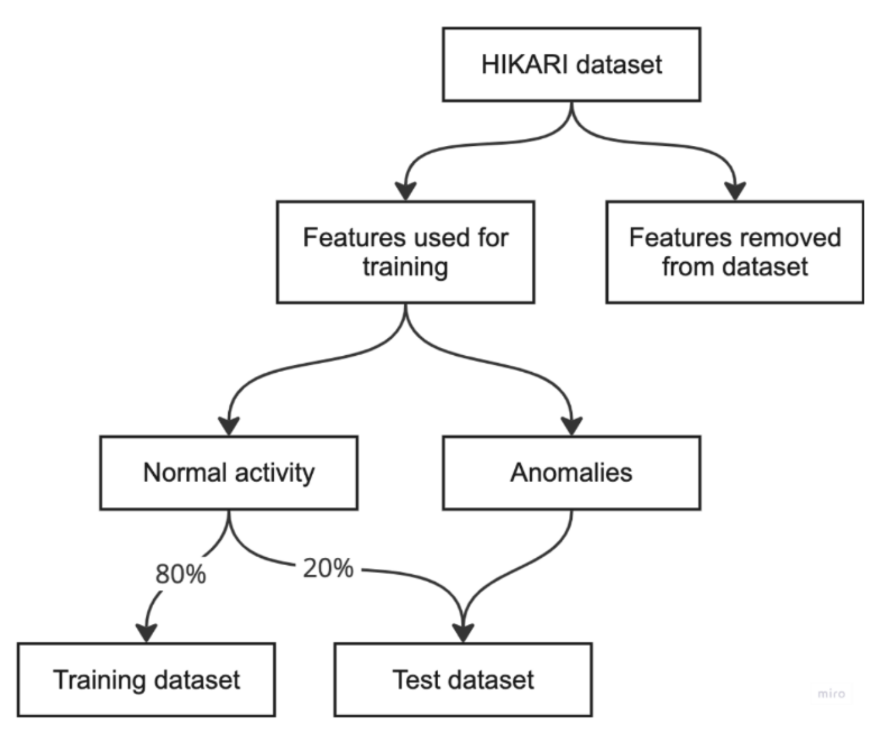
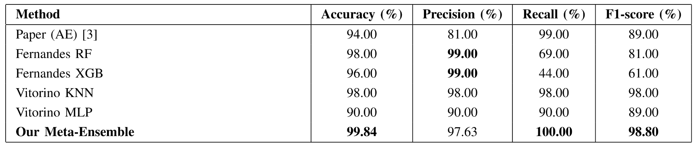
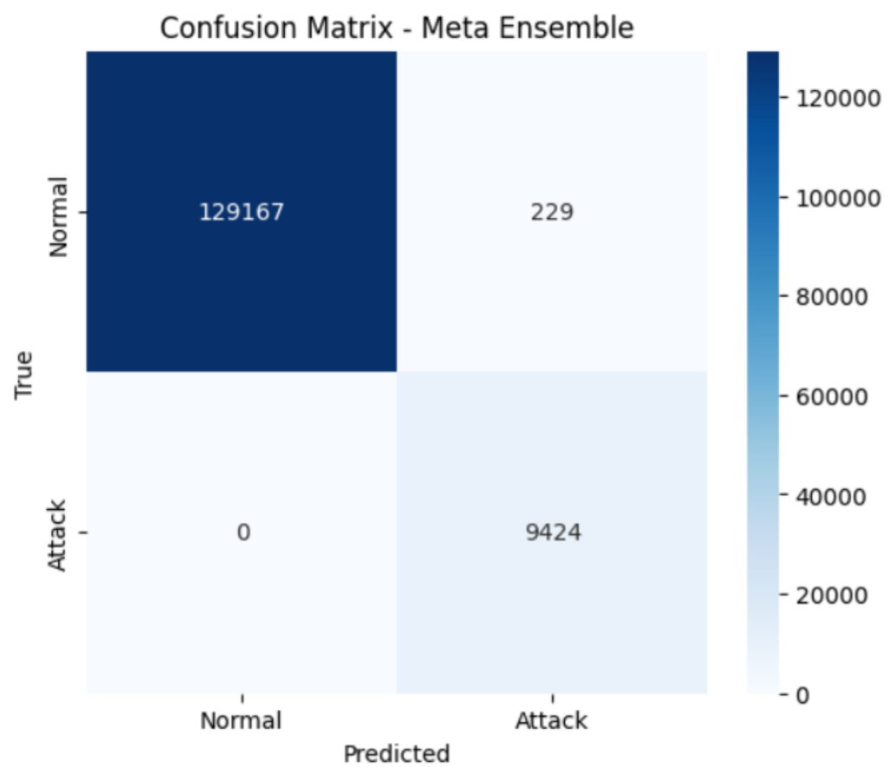

# MetaGuard – Hybrid Meta-Ensemble for HIKARI-2021

This project explores network intrusion detection on the **HIKARI‑2021** encrypted traffic dataset using a hybrid meta‑ensemble of autoencoders, XGBoost, Isolation Forest, and a final stacked meta-classifier.

## Data Preprocessing

## 📊 Results Overview

**Model comparison**

**Confusion matrix of the final meta-ensemble**

